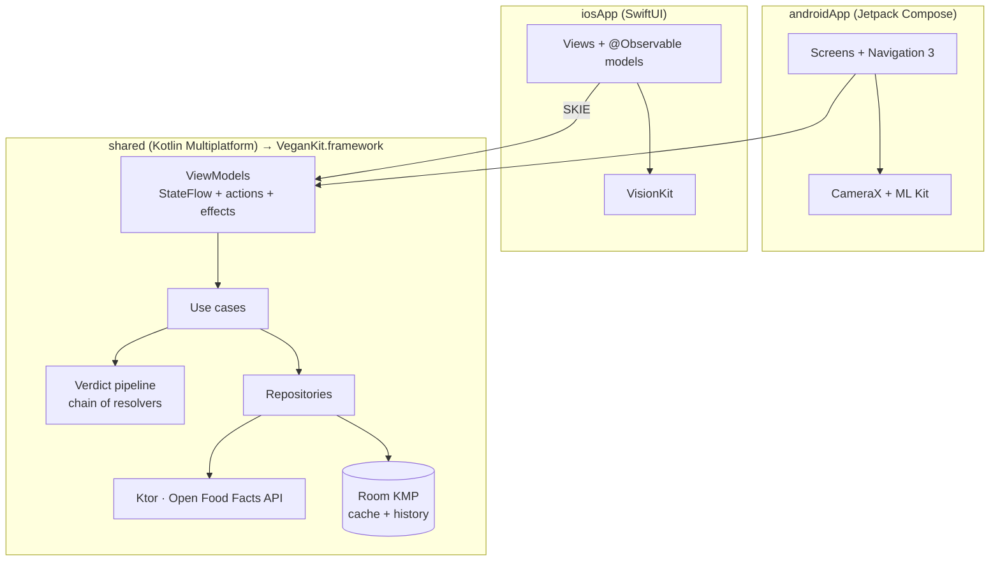

# Vegan Scanner 🌱

Scan a product's barcode and find out if it's vegan, on **Android and iOS**.
Vegan Scanner is free, open source, and built with **Kotlin Multiplatform**: the business logic is shared, and each platform has a native UI (Jetpack Compose and SwiftUI).

Product data comes from [Open Food Facts](https://world.openfoodfacts.org), the free, collaborative food database.

> **Status:** early development. Phase 1 (scanner MVP) is done. See the [roadmap](#roadmap).

## Features

- **Barcode scanning** on-device: CameraX + ML Kit on Android, VisionKit on iOS. Manual entry also works.
- **Explained verdicts:** *Vegan*, *Not vegan*, *Might not be vegan* or *Unknown*, with the ingredients that caused it and the data source.
- **Offline-first:** products are cached and scan history works without a connection.
- **English and Spanish.**
- `veganscanner://product/{barcode}` deep links.

Coming next: ingredient-label OCR, on-device AI for inconclusive products, shared community verdicts, and a local marketplace for vegan products with contact over WhatsApp.

## Architecture



- **Clean Architecture** per feature (`presentation` → `domain` → `data`), with **unidirectional data flow**: each ViewModel exposes `StateFlow<UiState>`, takes actions, and emits one-off effects.
- **One set of ViewModels on both platforms.** Android uses them through Koin + Navigation 3. On iOS, [SKIE](https://skie.touchlab.co) exposes them as Swift `AsyncSequence`s and enums, and `ViewModelStoreHolder` gives them a real lifecycle.
- **Verdict pipeline (Chain of Responsibility):** each resolver either decides or passes on what it learned. Adding the rule engine and on-device AI only means adding resolvers. See [ADR 0003](docs/adr/0003-verdict-pipeline.md).
- Design decisions are recorded in [`docs/adr`](docs/adr).

### Tech stack

| | |
|---|---|
| Shared | Kotlin 2.4 · Coroutines/Flow · Ktor 3 · kotlinx.serialization · Room KMP · Koin 4 · AndroidX ViewModel · Kermit |
| Android | Jetpack Compose · Material 3 · Navigation 3 · CameraX · ML Kit · Coil 3 |
| iOS | SwiftUI · Observation · VisionKit · SKIE · XcodeGen |
| Quality | kotlin.test · Turbine · Ktor MockEngine · Roborazzi · Swift Testing · XCUITest · ktlint + Compose rules · Android Lint · GitHub Actions · Renovate |

### Project structure

```
build-logic/           Gradle convention plugins
shared/
  core/common          AppResult/AppError, dispatchers, logging
  core/model           Domain models (Barcode, Product, VeganVerdict…)
  core/network         Ktor client + Open Food Facts API
  core/database        Room database, entities, DAOs
  core/testing         Recorded OFF fixtures, test clock, dispatcher helpers
  feature/scanner      Scanner domain, data and ViewModels
  umbrella             Koin wiring + the VeganKit iOS framework
androidApp/            Compose app
iosApp/                SwiftUI app (project.yml → XcodeGen)
docs/adr/              Architecture Decision Records
```

## Getting started

**Requirements:** JDK 17+ (Gradle provisions JDK 25 for the build), Android Studio with Android SDK 37, Xcode 26, and [XcodeGen](https://github.com/yonaskolb/XcodeGen) (`brew install xcodegen`).

```bash
git clone https://github.com/BrandonVargas/VeganScanner.git
cd VeganScanner
```

**Android:** open the project in Android Studio and run `androidApp`, or:

```bash
./gradlew :androidApp:installDebug
```

**iOS:**

```bash
cd iosApp && xcodegen && open VeganScanner.xcodeproj
```

Xcode builds the Kotlin framework automatically in a build phase. To run on a device, set your team in `iosApp/Configuration/Local.xcconfig` (git-ignored): `DEVELOPMENT_TEAM = XXXXXXXXXX`.

The simulator has no camera, so type a barcode or open a deep link:

```bash
xcrun simctl openurl booted "veganscanner://product/3017620422003"
```

## Testing

```bash
./gradlew spotlessCheck                      # ktlint + Compose rules
./gradlew testAndroidHostTest                # shared tests on the JVM
./gradlew iosSimulatorArm64Test              # shared tests on the iOS simulator
./gradlew :androidApp:testDebugUnitTest      # Android unit + Roborazzi screenshot tests
./gradlew :androidApp:lintDebug
```

```bash
cd iosApp && xcodebuild test -project VeganScanner.xcodeproj -scheme VeganScanner \
  -destination 'platform=iOS Simulator,name=iPhone 17'
```

Screenshot baselines live in `androidApp/src/test/screenshots`. Re-record them with `./gradlew :androidApp:recordRoborazziDebug`.

## Roadmap

- [x] **Phase 0:** KMP foundation, CI, docs
- [x] **Phase 1:** Scanner MVP: barcode → Open Food Facts → explained verdict, offline history, en/es
- [ ] **Phase 2:** Rule engine (en/es ingredient dictionary) + ingredient-label OCR
- [ ] **Phase 3:** On-device AI for inconclusive products (Gemini Nano / Apple Foundation Models)
- [ ] **Phase 4:** Supabase + community verdicts (shared AI results, with community reports)
- [ ] **Phase 5:** Local marketplace: listings near you, contact over WhatsApp
- [ ] **Phase 6:** Trust & safety, privacy, accessibility
- [ ] **Phase 7:** Google Play & App Store release

## Contributing

Contributions are welcome, especially to the ingredient dictionary in phase 2. See [CONTRIBUTING.md](CONTRIBUTING.md).

## Data & license

- Product data: © [Open Food Facts](https://world.openfoodfacts.org) contributors, available under the [Open Database License](https://opendatacommons.org/licenses/odbl/1-0/). Verdicts are a guide, not a guarantee. Always check the label.
- Code: [Apache License 2.0](LICENSE) © 2026 Brandon Vargas.
